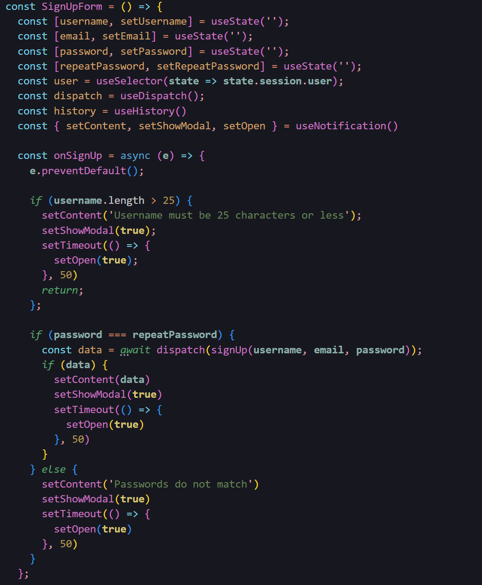
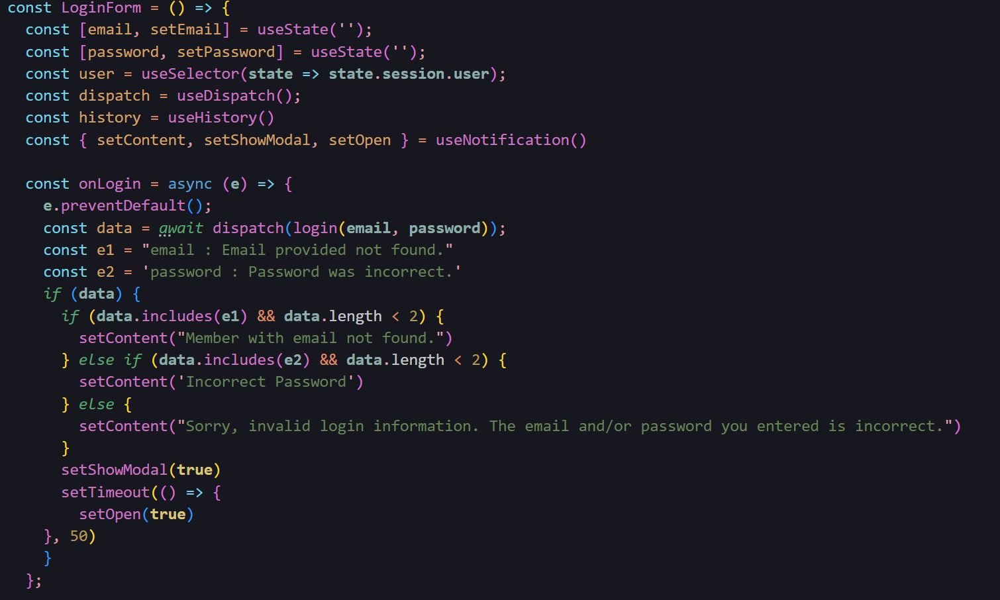
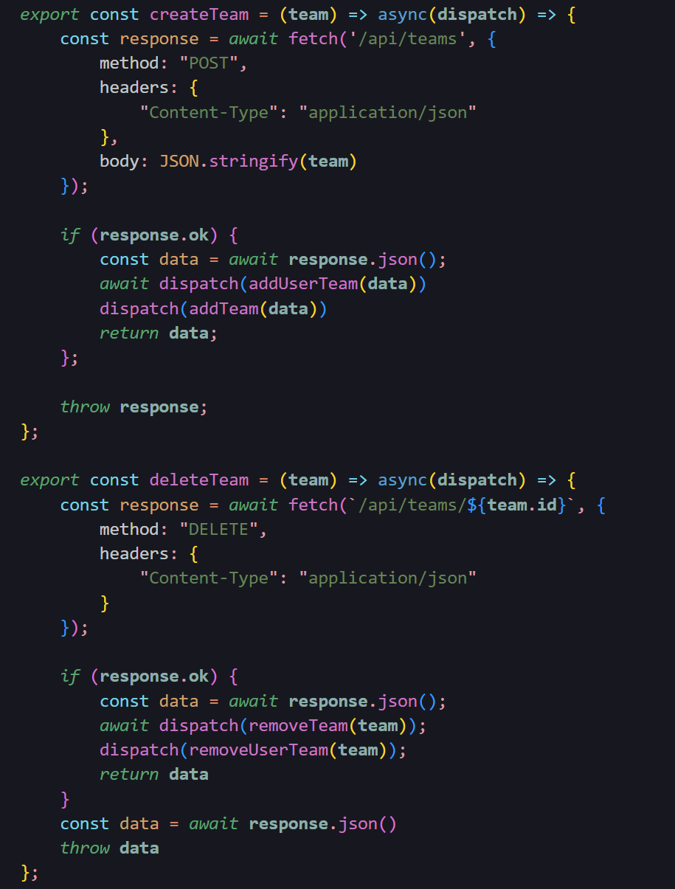
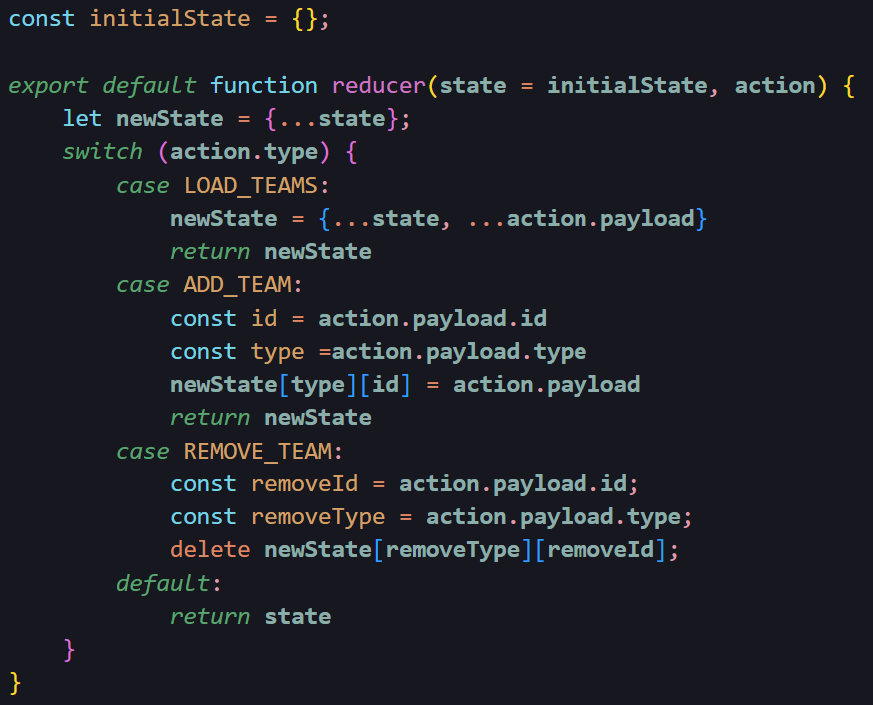

# Rocket Pilled

<a href='https://rocketpilled.onrender.com/' alt=''>Rocket Pilled</a> is a mix between a passion project and a website clone, inspired by <a href='https://www.checkmategaming.com/' alt=''>CheckMateGaming</a>. Rocket Pilled is a site where Rocket League players can go to make solo, duo, or squad teams, and go head to head against each other to compete for experience points.

## ✅ Wiki Link

- [Database Schema](https://github.com/prestonprince/RocketPilled/wiki/DB-Schema)
- [Feature List](https://github.com/prestonprince/RocketPilled/wiki/MVP-Feature-List)
- [Redux State Shape](https://github.com/prestonprince/RocketPilled/wiki/Redux-State-Shape)
- [User Stories](https://github.com/prestonprince/RocketPilled/wiki/User-Stories)

## 👩‍💻 Tech Stack

**Frameworks, Platforms and Libraries:**

      


**Database:**


**Hosting:**


# MVP Features

## Sign Up

Users can access Sign Up via the 'Join Free' button in the top right.


### Sign Up Form Component

This is the component the user sees when filling out the form to sign up as a new user. Controlled inputs are used here in conjunction with the React useState hook, and the function onSignUp is invoked when the form is submitted. 



## Log In 

Users can access Log In via the 'Sign In' button in the top right.


### Log In Form Component

This is the component the user sees when filling out the form to log in as an existing user. Controlled inputs are used here in conjunction with the React useState hook, and the function onLogin is invoked when the form is submitted. 



## Make Teams and Post/Accept Matches

Logged in users can make a Solo, Duo, or Squad team, and post or accept matches.


### Create/Delete Teams Thunk Actions and Reducer Using React-Redux
When creating or deleting a team, these functions are invoked, which make a call to the backend server, inputting data or deleting data from the database, which is then communicated through the Redux store. 



## 💻 Run Locally

Clone the project

```bash
  git clone https://github.com/prestonprince/RocketPilled.git
```

Go to the project directory

```bash
  cd rocket_pilled
```

Install dependencies

Backend

```bash
pip install -r requirements.txt &&
flask db upgrade &&
flask seed all
```

Frontend

```bash
cd react-app
npm install
```

Start the server

```bash
pipenv run flask run
```

In seperate terminal

```bash
cd react-app
npm start
```

## 🖥 Environment Variables

To run this project, you will need to add the following environment variables to your .env file

```
SECRET_KEY=boostedGG
DATABASE_URL=sqlite:///dev.db
SCHEMA=rocket_pilled
```
